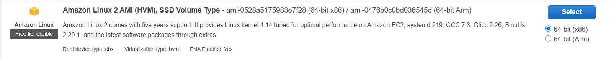
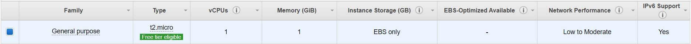

# How to Dockerize and Deploying a Ruby on Rails Application that is a Simple Photosite

## Table of Contents
1. [Intro and Purpose](#1-intro-and-purpose)
	  - [How to create and Configure EC2 instance](#create-ec2)
	  - [Create a Docker Image locally and push it to Docker Hub Repo](#create-docker-container)
2. [Demonstration of Application working](#2-demonstration-of-application-working)
3. [Things that are not working](#3-things-that-are-not-working)
4. [YouTube walkthrough](#4-youtube-walkthrough)
5. [Adv - What happens when an instance stops running?! What shall I do?](#5-adv---what-happens-when-an-instance-stops-running-what-shall-i-do)
6. [Adv - What happens when you reboot an instance?? What can be done??](#6-adv---what-happens-when-you-reboot-an-instance-what-can-be-done)

<br>

## 1. Intro and Purpose

This is a Ruby on Rails (RoR) application that is a very simple photo website that utilizes the Sqlite3 database. The database as has 3 tables, one for Users, Photos, and Comments. The relationship between these tables are the following:<br>
  * A User can have many photos and many Comments
  * A Photo belongs to one User and has many Comments
  * A Comment belongs to one User and one Photo<br>

There are 2 URI the website has. One is the **user/index** which lists all the users in the database. The other one is the **photo/index/:id** where id parameter is the User Id and it displays all the all Photos associated with that User Id and under each photo, it displays all the comments for that photo with the corresponding author of the comment.<br>

<a name = "create-ec2" /> <br>

**How to create and Configure EC2 instance** <br>
Here is the [link][youtube link to create and configure EC2] for my youtube video going through the setup <br>

<a name = "create-docker-container" /> <br>

**Create a Docker Image locally and push it to Docker Hub Repo** <br>

1. Create a **Dockerfile** with the following: <br>
	```
	FROM ruby:2.6.6

	WORKDIR /usr/src/app
	COPY Gemfile* ./
	RUN bundle install
	COPY . .

	RUN curl -sS https://dl.yarnpkg.com/debian/pubkey.gpg | apt-key add -
	RUN echo "deb https://dl.yarnpkg.com/debian/ stable main" | tee /etc/apt/sources.list.d/yarn.list
	RUN apt-get update -qq && apt-get install -y yarn
	RUN yarn install

	EXPOSE 3000
	CMD ["rails", "server", "-b", "0.0.0.0"]
	```
	You can find out more information on how to setup a Dockerfile from [here](https://docs.docker.com/develop/develop-images/dockerfile_best-practices/).<br>

2. Now build our image by doing the following command in our terminal<br>
	```
	docker build -t anitesh93/photosite-app .
	```
	This creates a local docker image called "anitesh93/photosite-app"<br>

3. Launch a container from the newly built image by doing the following in the terminal<br>
	```
	docker run -p 3000:3000 anitesh93/photosite-app
	```
	The command above will create a docker container using the "anitesh93/photosite-app" image you created in Step #2. The "-d" flag tells docker daemon to run this container in "daemon mode". <br>
	You can go to to the [Official Docker Documentation](https://docs.docker.com/engine/reference/commandline/docker/) to find out all the commands docker allows.<br>
4. Publishing the Docker Image <br>
	We run the following in the command line<br>
	```
	docker login
	```
	This will prompt you to enter your Docker Hub username and then password so that you. <br>
	Next we push our Docker image to the registy with the following<br>
	```
	docker push anitesh93/photosite-app
	```
	Now this image is avaiable via the internet so we will be able to pull it on our EC2 instance.<br>
	[Here](https://reflectoring.io/aws-deploy-docker-image-via-web-console/) is the tutorial that i followed to make the Dockerfile and publish it<br>


## 2. Demonstration of Application working
1. **Set up Amazon EC2** <br>
	You have to have an AWS account to do the following steps.
	1. Login in to you AWS account and nativate to the EC2 Dashboard that looks like this.<br>
		 <br>
		Then click on the Launch Instance
	2. Select an AMI. I choose the following <br>
		 <br>
	3. Next we choose the Instance type <br>
		 <br>
	4. Set the Security group <br>
		 <br>
		I have these ports open in the inbound section because my app will run on port 3000 so we need anyone to have access to it
	5. Then after clicking on 'Review And Launch'. Create a new key pair. <br>
		
		This gives you a private key that you will use to access this instance.
2. **Connect to the EC2 Instance** <br>
	
	1. Click on the 'Instance' on the left
	2. Click on your Instance you want to connect to
	3. Click on Connect which brings us to following
	
	In our command line, we would have to go to the directory that has our key pair file and then run this command <br>
	```
	ssh -i "awsR1.pem" ec2-user@ec2-54-185-32-54.us-west-2.compute.amazonaws.com
	```
	Once we have successfully connected. This is how it looks <br>
	
	<br>
3. **Installing Docker on EC2 Instance** <br>
	1.Update the installed packages and package cache on your instance
	```
	sudo yum update -y
	```
	2. Install the most recent Docker Community Edition package for Amazon Linux 2
	```
	sudo amazon-linux-extras install docker
	```
	3. Start the Docker service.
	```
	sudo service docker start
	```
	4. Add the ec2-user to the docker group so you can execute Docker commands without using sudo.
	```
	sudo usermod -a -G docker ec2-user
	```
	5. Log out and log back in again to pick up the new docker group permissions. You can accomplish this by closing your current SSH terminal window and reconnecting to your instance in a new one. Your new SSH session will have the appropriate docker group permissions.

4. **Pulling my Custom Docker Image and creating a container**
	1. Use the following command to pull this image onto the EC2 instance
	```
	docker pull anitesh93/photosite-app
	```
	2. Now we can use the following command to 
	```
	docker run -p 3000:3000 anitesh93/photosite-app:latest
	```
	We now should be able to access our Photosite with our instance Public IPv4 address with the port 3000 <br> ex. [http://54.185.32.54:3000](http://54.185.32.54:3000) <br>
	iii. To see that our container is running
	```
	docker ps -all
	```
	We should see all the containers that are running currently<br>
	
## 3. Things that are not working
This section is very short because everything is working which is a good thing!!!

## 4. YouTube walkthrough
[Link to my youtube tutorial](https://youtu.be/PBpXgQWBLyA)
## 5. Adv - What happens when an instance stops running?! What shall I do?
When an instance stops, you lose your environment and data so you have to do all the steps to setup your instances again.<br>
To prevent re-setup for our environment and data. We can create our own AMI.<br>
 <br>
We select the instance that we want to create an image of. <br>
Then we click on the 'Action' dropdown and select 'Image' option and then click on 'Create image'<br>
It will bring us to a page where you name your image and then finish creating your image. It may take a few minutes for your image to be created.<br>
To access your image, you Click on the AMI under the Images menu as shown by the following picture <br>
<br>
You should arrive to a page that lists all the images that you have created.<br>
To create an instance with a image, you just select the image and click on 'Launch'<br>
<br>
Then you will have to configure the instance as I have explain how to do previously.<br>
After a few minutes the instance the instance is created. So now we should be able access this instance through SSH terminal.<br>
Once you login, you can see that your environment and files are still there so you don't have to re-download things.<br>
You can run the Docker Container for the Photosite, without downloading and setting it up on the instances and access the app through the new instances' public IPv4 at port 3000<br>
	

## 6. Adv - What happens when you reboot an instance?? What can be done??
The IP address changes so we have to find the new public IPv4 to access our app. How to get access to my website despite the IP address of EC2 changes?<br>
**Use [Elastic IP](https://docs.aws.amazon.com/AWSEC2/latest/UserGuide/elastic-ip-addresses-eip.html)** <br>
	1. Click on the 'Elastic IP' under 'Network & Security' tab on the left side<br>
	
	<br>
	2.Now you have to choose the Elastic IP that you just created and click on the 'Action' mean which has an option called 'Associate Elastic IP Address' that we click on.
	 <br>
	3. Now we choose our instances that we want to bind to this Elastic IP Address and Click on Associate to complete.
	
	4. Now we should be able to access the app with the Elastic IP Address


[youtube link to create and configure EC2]: https://youtu.be/PBpXgQWBLyA
